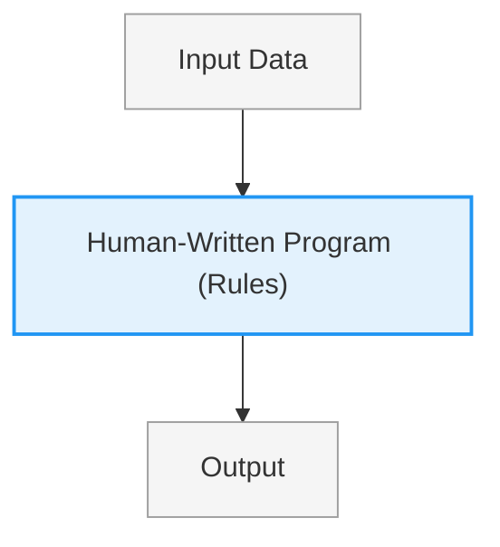
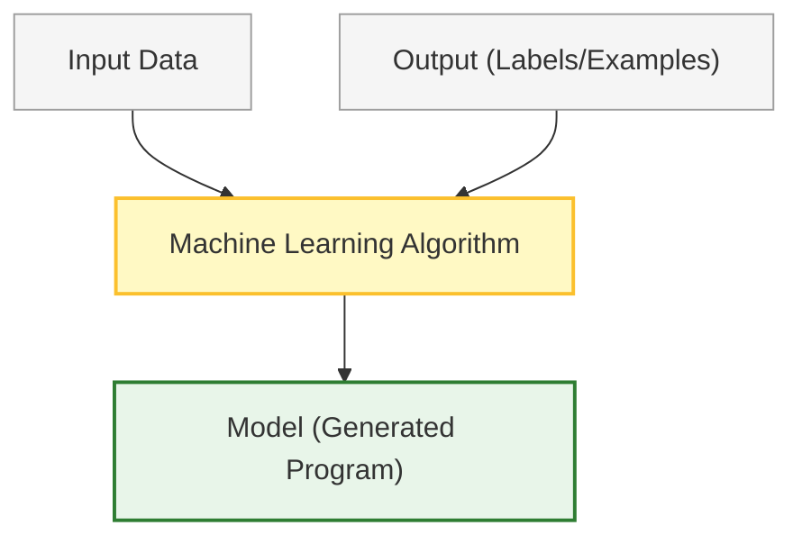
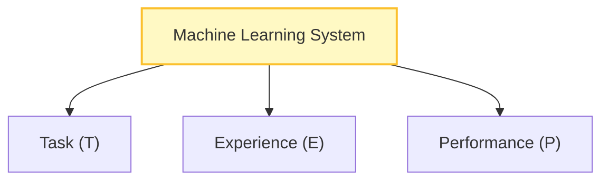
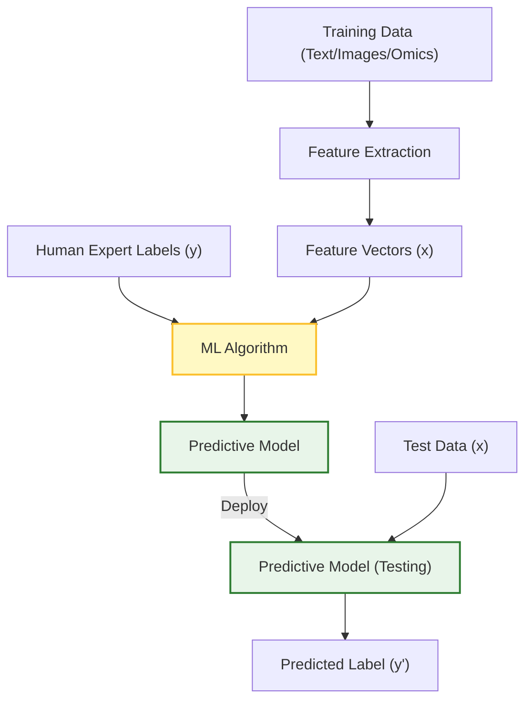

# 📖 Machine Learning Study Guide: Lecture 1 (Introduction)

This study guide summarizes the core concepts of Machine Learning introduced in Lecture 1, focusing on the transition from traditional programming, the formal definition of machine learning, classification of tasks, and the primary learning paradigms.

---

## 1. Paradigm Shift: Traditional Programming vs. Machine Learning

Machine Learning introduces a fundamental change in how computer programs are constructed:

### A. Traditional Programming
In traditional programming, humans write explicit logical rules (a program) and input data into the computer to generate an output.

### B. Machine Learning
In machine learning, we feed the computer both input data and the corresponding output/experience. The machine learning algorithm analyzes this data to generate the program (the predictive model/logic).

---

## 2. The Formal Definition of Machine Learning

To evaluate and design machine learning systems, we use Tom Mitchell's formal framework. A computer program is said to learn from **Experience ($E$)** with respect to some class of **Tasks ($T$)** and **Performance measure ($P$)**, if its performance at tasks in $T$, as measured by $P$, improves with experience $E$.

---

## 3. The Task ($T$)

Machine learning is used to solve problems that are too complex to resolve using traditional, fixed, human-written programs.

### Common Machine Learning Tasks

#### 1. Classification
*   **Definition:** The system is asked to specify which of $K$ discrete categories an input belongs to.
*   **Goal:** Map inputs into a set of discrete classes.
*   **Examples:** Image classification (categorizing images by color/object), credit risk assessment (Good vs. Bad risk).

#### 2. Regression
*   **Definition:** The system is asked to predict a continuous numerical value given some input.
*   **Goal:** Map inputs into a continuous output space.
*   **Examples:** Predicting real-estate housing prices, predicting stock prices.

#### 3. Transcription
*   **Definition:** The system observes a relatively unstructured representation of data and transcribes it into a discrete, textual sequence.
*   **Examples:** Optical Character Recognition (OCR) where a photo of text is transcribed into character strings; Automatic Speech Recognition (ASR).

#### 4. Machine Translation
*   **Definition:** The system takes an input sequence of symbols in one language and converts it into a sequence of symbols in another language.
*   **Examples:** Translating text from English to Arabic.

### Other Notable Tasks
*   **Recognizing Patterns:** Face detection/expression recognition, voice identification, medical image analysis.
*   **Generating Patterns:** Generating images, textures, or motion sequences.
*   **Recognizing Anomalies:** Detecting unusual credit card transactions, identifying sensor reading anomalies in power plants.
*   **Prediction:** Estimating future currency exchange rates or weather patterns.

---

## 4. The Experience ($E$)

Experience in machine learning is represented as a **Dataset** containing historical information.

*   **Dataset:** A collection of many data examples.
*   **Example (Data Point):** A collection of features quantitatively measured from an object or event.
*   **Features:** Individual measurable properties or characteristics of the phenomenon being observed (usually encoded as a feature vector $\vec{x} = [x_1, x_2, \dots, x_n]$).

---

## 5. The Performance Measure ($P$)

To evaluate the learning algorithm, we must design a quantitative measure of its performance. This measure is specific to the Task ($T$) being carried out.

*   **Accuracy:** The proportion of examples for which the model produces the correct output.
    $$\text{Accuracy} = \frac{\text{Correct Predictions}}{\text{Total Predictions}}$$
*   **Error Rate:** The proportion of examples for which the model produces an incorrect output.
    $$\text{Error Rate} = \frac{\text{Incorrect Predictions}}{\text{Total Predictions}} = 1 - \text{Accuracy}$$

---

## 6. When to Use Machine Learning

Machine learning is best applied under the following conditions:
*   **No Human Expertise:** When human expertise does not exist for the problem (e.g., navigating a rover autonomously on Mars).
*   **Unexplainable Expertise:** When humans can perform the task but cannot explain how they do it (e.g., speech recognition, face detection).
*   **Need for Customization:** When models must be dynamically customized to individual users (e.g., personalized medicine, recommendation engines).
*   **Scale of Data:** When solutions are based on search spaces or data volumes that are too vast for human analysis (e.g., genomics, global web traffic analysis).

---

## 7. Learning Paradigms: Supervised vs. Unsupervised Learning

Machine learning algorithms are broadly categorized based on the type of experience they receive during training:

### A. Supervised Learning
The system is provided with a labeled dataset containing the "right answers." The goal is to learn a mapping from inputs ($X$) to outputs ($Y$).

*   **Key Characteristic:** Labeled training data is provided.
*   **Problem Subtypes:**
    1.  **Regression:** Predicts a continuous valued output (e.g., predicting house price based on size).
    2.  **Classification:** Predicts a discrete category output (e.g., diagnosing a lung tumor as malignant ($1$) or benign ($0$)).

#### Supervised Learning Workflow

---

### B. Unsupervised Learning
The system is given unlabeled data and must discover underlying structures, patterns, or groupings within the dataset without any external feedback or "teacher."

*   **Key Characteristic:** Unlabeled data ($X$ only, no corresponding $Y$).
*   **Primary Tool:** **Clustering** (grouping data points together based on mathematical similarity).
*   **Applications:**
    *   **Gene Expression Clustering:** Grouping individuals together based on the similarity of their gene expressions (microarray data) to discover sub-populations or disease subtypes.
    *   **Customer Segmentation:** Grouping customers based on purchasing behaviors.

---

### Summary Comparison: Learning Types

*   **Training Data:**
    *   **Supervised Learning:** Labeled data ($X$ and $Y$ provided)
    *   **Unsupervised Learning:** Unlabeled data ($X$ only)
*   **Feedback:**
    *   **Supervised Learning:** Explicit corrections (Loss function compares predictions to true labels)
    *   **Unsupervised Learning:** No feedback (No target labels or "teacher")
*   **Output Type:**
    *   **Supervised Learning:** **Discrete** (Classification) or **Continuous** (Regression)
    *   **Unsupervised Learning:** Groupings (**Clusters**) or structural patterns
*   **Core Goal:**
    *   **Supervised Learning:** Learn mappings to predict outcomes for unseen inputs
    *   **Unsupervised Learning:** Explore relationships and discover hidden structures in the data

