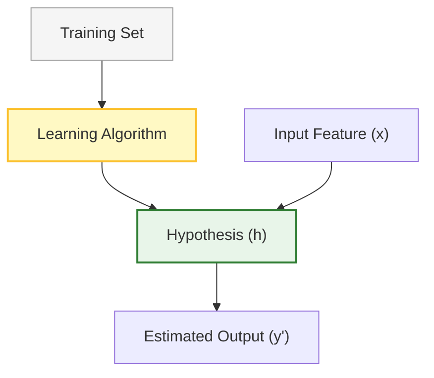
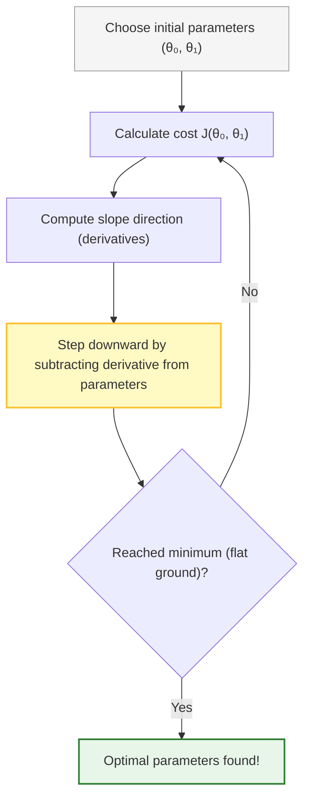

# 📖 Machine Learning Study Guide: Linear Regression with One Variable (Detailed Reference)

This document provides a detailed reference covering the mathematical foundations, notations, optimization algorithms, and graphical models of Univariate Linear Regression.

---

## 1. Model Representation

In supervised learning with regression, our goal is to predict a continuous valued output based on labeled input data. For **univariate linear regression** (linear regression with one variable), we model the relationship between a single independent variable and a dependent variable as a straight line.

### Core Concepts
*   **Supervised Learning:** A machine learning paradigm where the algorithm learns from a training set containing both the input features and the correct target labels.
*   **Regression:** The task of predicting a continuous numerical value (such as housing prices, weights, or temperatures).
*   **Independent Variable ($x$):** The input variable used as a predictor, also called the **feature**.
*   **Dependent Variable ($y$):** The output variable that we want to predict, also called the **target variable**.

### Key Notation

*   $m$: The total number of training examples (the size of the dataset).
*   $x$: The independent input variable.
*   $y$: The dependent output variable.
*   $(x, y)$: Represents a single training example (a single data row).
*   $(x^{(i)}, y^{(i)})$: Represents the specific $i$-th training example in the dataset.

> [!IMPORTANT]
> The superscript $(i)$ is an **index** pointing to the $i$-th row of your dataset. It is **not** an exponent (it does not mean "$x$ to the power of $i$").
> *   *Examples:*
>     *   $x^{(1)} = 2104$ (the feature value of the first training example)
>     *   $y^{(2)} = 232$ (the target value of the second training example)
>     *   $x^{(4)} = 852$ (the feature value of the fourth training example)

### The Supervised Learning Pipeline

The training set is fed into the learning algorithm. The learning algorithm outputs a function, traditionally denoted as $h$ (standing for **hypothesis**). The hypothesis function takes an input $x$ and estimates the output value $y$.

*   **Hypothesis ($h$):** The model function that maps from the independent feature space ($x$) to the estimated target space ($y$).

### The Hypothesis Function
For linear regression with one variable, we represent the hypothesis function $h_\theta(x)$ as:
$$h_\theta(x) = \theta_0 + \theta_1 x$$

*   $\theta_0$ and $\theta_1$ are the **parameters** (or weights) of the model.
*   $\theta_0$ represents the **y-intercept** (the value of $y$ when $x = 0$).
*   $\theta_1$ represents the **slope** of the line (change in $Y$ divided by the change in $X$).

### Types of Regression Relationships
Before building a model, it is helpful to visualize the data using a **scatter plot** of all $(x^{(i)}, y^{(i)})$ pairs. The shape of the scatter plot suggest which regression relationship best fits the data:

*   **Positive Linear Relationship:** As $x$ increases, $y$ increases linearly (slope $\theta_1 > 0$).
*   **Negative Linear Relationship:** As $x$ increases, $y$ decreases linearly (slope $\theta_1 < 0$).
*   **Relationship NOT Linear:** The relationship is curved or non-linear (a straight line is not a suitable model).
*   **No Relationship:** The data points are scattered randomly; changes in $x$ do not correlate with changes in $y$.

---

## 2. Parameter Tuning Intuition

Varying the parameters $\theta_0$ and $\theta_1$ allows us to fit different lines:
*   **Intercept Unchanged (Varying Slope $\theta_1$):** The line rotates around its anchor point $(0, \theta_0)$ on the y-axis.
*   **Slope Unchanged (Varying Intercept $\theta_0$):** The line shifts vertically up or down parallel to its original position.
*   **Varying Both ($\theta_0$ and $\theta_1$):** The line shifts vertically and rotates.

---

## 3. The Cost Function (Least Squares)

To find the line that "best fits" our data, we must choose values for $\theta_0$ and $\theta_1$ such that the difference between the actual values ($y$) and predicted values ($h_\theta(x)$) is minimized. 

### Residual Error
For any training example $i$, the prediction error (or residual error $\varepsilon_i$) is the vertical distance between the data point and the hypothesis line:
$$\varepsilon_i = y^{(i)} - h_\theta(x^{(i)})$$
The actual target value can be expressed as:
$$y^{(i)} = h_\theta(x^{(i)}) + \varepsilon_i$$

### Least Squares (LS)
The method of Least Squares minimizes the Sum of the Squared Differences (errors) (SSE):
$$\text{SSE} = \sum_{i=1}^{m} \varepsilon_i^2 = \sum_{i=1}^{m} \left( y^{(i)} - h_\theta(x^{(i)}) \right)^2$$

### Mean Squared Error (MSE) Cost Function
To prevent positive and negative errors from canceling each other out, we square the errors. The average of these squared errors defines our cost function $J(\theta_0, \theta_1)$, also called the **Mean Squared Error (MSE)** or **Squared Error Cost Function**:

$$J(\theta_0, \theta_1) = \frac{1}{2m} \sum_{i=1}^{m} \left( h_\theta(x^{(i)}) - y^{(i)} \right)^2$$

*   The factor of $\frac{1}{2}$ is added for mathematical convenience (it cancels out the power of $2$ when we calculate derivatives).
*   Our optimization goal is to **minimize** $J(\theta_0, \theta_1)$ to find the optimal parameters.

### Cost Function Visualization (with $\theta_0 = 0$)
To understand the cost function, we can simplify the model by setting the intercept parameter $\theta_0 = 0$, giving us:
$$h_\theta(x) = \theta_1 x$$

*   **Hypothesis $h_\theta(x)$:** A function of the input variable $x$. Its slope changes as we vary $\theta_1$.
*   **Cost Function $J(\theta_1)$:** A function of the parameter $\theta_1$.
    *   Plotting $J(\theta_1)$ against different values of $\theta_1$ produces a 2D **parabola** (convex function).
    *   The bottom of this parabola is the global minimum where the prediction error is minimized.
    *   If the data points align perfectly with a slope of $1$, then at $\theta_1 = 1$, the cost $J(1) = 0$.

---

## 4. Cost Function Mathematical Walkthrough

Let's compute the cost $J(\theta_1)$ step-by-step for a simplified hypothesis ($h_\theta(x) = \theta_1 x$) using a small dataset with 3 training examples: $\{(1,1), (2,2), (3,3)\}$ where $m=3$.

### Scenario A: Let $\theta_1 = 1.0$
*   Hypothesis: $h(x) = 1.0 \cdot x \Rightarrow$ Predictions: $h(1)=1$, $h(2)=2$, $h(3)=3$.
*   Cost Calculation:
    $$J(1.0) = \frac{1}{2(3)} \left[ (1-1)^2 + (2-2)^2 + (3-3)^2 \right] = \frac{1}{6} [0] = 0$$
*   *Result:* The cost is $0$, meaning the line fits the data perfectly.

### Scenario B: Let $\theta_1 = 0.5$
*   Hypothesis: $h(x) = 0.5 \cdot x \Rightarrow$ Predictions: $h(1)=0.5$, $h(2)=1.0$, $h(3)=1.5$.
*   Cost Calculation:
    $$J(0.5) = \frac{1}{6} \left[ (0.5-1)^2 + (1.0-2)^2 + (1.5-3)^2 \right]$$
    $$J(0.5) = \frac{1}{6} \left[ (-0.5)^2 + (-1.0)^2 + (-1.5)^2 \right] = \frac{1}{6} [0.25 + 1.0 + 2.25] = \frac{3.5}{6} \approx 0.583$$

### Scenario C: Let $\theta_1 = 2.0$
*   Hypothesis: $h(x) = 2.0 \cdot x \Rightarrow$ Predictions: $h(1)=2$, $h(2)=4$, $h(3)=6$.
*   Cost Calculation:
    $$J(2.0) = \frac{1}{6} \left[ (2-1)^2 + (4-2)^2 + (6-3)^2 \right] = \frac{1}{6} [1 + 4 + 9] = \frac{14}{6} \approx 2.33$$

---

## 5. Analytical vs. Numerical Solutions

How do we find the parameters $(\theta_0, \theta_1)$ that minimize the cost function when we have multiple features?

*   **Plotting / Grid Search:** Not practical in higher dimensions because the parameter space becomes too vast to calculate and visualize.
*   **Analytical Solution (e.g., Normal Equation):**
    *   *Concept:* Solve for the minimum mathematically by setting the derivative to zero and solving for $\theta$ using matrix algebra.
    *   *Limitation:* Extremely slow or mathematically complex to invert matrices for large datasets.
*   **Numerical Solution (e.g., Gradient Descent):**
    *   *Concept:* An iterative algorithm that starts with random parameters and takes small, successive steps downward to find the minimum. It scales efficiently to large datasets.

---

## 6. The Gradient Descent Algorithm

Gradient Descent is an iterative optimization algorithm used to minimize a cost function $J$.

### The Metaphor: Hilly Landscape
Imagine standing at a high point in a landscape of a grassy park (red areas represent high elevation/cost; blue areas represent low elevation/cost). Your goal is to reach the lowest point in the park as rapidly as possible.
1.  You look around and determine the direction of the steepest descent.
2.  You take a step in that direction.
3.  You repeat this process until you reach a flat area (a local minimum).
*   **Different Starting Points:** Depending on where you initialize the starting parameters, gradient descent can settle into different **local minima** (valleys that are not the absolute lowest point of the entire function).
*   **Convexity in Linear Regression:** Because the Mean Squared Error cost function is a **convex quadratic function** (a perfect bowl shape), it has **no local minima other than the single global minimum**. Gradient descent will always find the global minimum if $\alpha$ is configured correctly.

### The General Update Rule
Repeat until convergence (where the parameters stop changing significantly):
$$\theta_j := \theta_j - \alpha \frac{\partial}{\partial \theta_j} J(\theta_0, \theta_1) \quad (\text{for } j=0 \text{ and } j=1)$$

*   **$\alpha$ (Learning Rate):** A positive constant that determines the step size.
    *   If $\alpha$ is **too small**, gradient descent will take many steps and be very slow.
    *   If $\alpha$ is **too large**, gradient descent can overshoot the minimum, fail to converge, or even diverge.
*   **$\frac{\partial}{\partial \theta_j} J(\theta_0, \theta_1)$ (Derivative/Slope):**
    *   If the slope is **positive**, the subtraction moves the parameter to the **left** (decreasing $\theta_j$).
    *   If the slope is **negative**, the subtraction moves the parameter to the **right** (increasing $\theta_j$).

> [!IMPORTANT]
> **Simultaneous Update Requirement:**
> When implementing gradient descent, you must update both parameters **simultaneously** using temporary variables.
> $$\text{temp}_0 := \theta_0 - \alpha \frac{\partial}{\partial \theta_0} J(\theta_0, \theta_1)$$
> $$\text{temp}_1 := \theta_1 - \alpha \frac{\partial}{\partial \theta_1} J(\theta_0, \theta_1)$$
> $$\theta_0 := \text{temp}_0$$
> $$\theta_1 := \text{temp}_1$$

---

## 7. Batch Gradient Descent for Linear Regression

By applying the derivatives of the Mean Squared Error cost function to the gradient descent algorithm, we obtain the update equations for univariate linear regression:

### Deriving the Equations (Using Calculus Chain Rule)
To find the partial derivatives of our cost function $J(\theta_0, \theta_1) = \frac{1}{2m} \sum_{i=1}^{m} (h_\theta(x^{(i)}) - y^{(i)})^2$:

1.  **For $\theta_0$ ($j = 0$):**
    $$\frac{\partial}{\partial \theta_0} J(\theta_0, \theta_1) = \frac{\partial}{\partial \theta_0} \left[ \frac{1}{2m} \sum_{i=1}^{m} \left( \theta_0 + \theta_1 x^{(i)} - y^{(i)} \right)^2 \right]$$
    $$\frac{\partial}{\partial \theta_0} J(\theta_0, \theta_1) = \frac{1}{2m} \sum_{i=1}^{m} 2\left( h_\theta(x^{(i)}) - y^{(i)} \right) \cdot \frac{\partial}{\partial \theta_0}\left( \theta_0 + \theta_1 x^{(i)} - y^{(i)} \right)$$
    $$\frac{\partial}{\partial \theta_0} J(\theta_0, \theta_1) = \frac{1}{m} \sum_{i=1}^{m} \left( h_\theta(x^{(i)}) - y^{(i)} \right)$$

2.  **For $\theta_1$ ($j = 1$):**
    $$\frac{\partial}{\partial \theta_1} J(\theta_0, \theta_1) = \frac{\partial}{\partial \theta_1} \left[ \frac{1}{2m} \sum_{i=1}^{m} \left( \theta_0 + \theta_1 x^{(i)} - y^{(i)} \right)^2 \right]$$
    $$\frac{\partial}{\partial \theta_1} J(\theta_0, \theta_1) = \frac{1}{2m} \sum_{i=1}^{m} 2\left( h_\theta(x^{(i)}) - y^{(i)} \right) \cdot \frac{\partial}{\partial \theta_1}\left( \theta_0 + \theta_1 x^{(i)} - y^{(i)} \right)$$
    $$\frac{\partial}{\partial \theta_1} J(\theta_0, \theta_1) = \frac{1}{m} \sum_{i=1}^{m} \left( h_\theta(x^{(i)}) - y^{(i)} \right) \cdot x^{(i)}$$

### The Final Update Rules
Repeat until convergence:

1.  $$\theta_0 := \theta_0 - \alpha \frac{1}{m} \sum_{i=1}^{m} \left( h_\theta(x^{(i)}) - y^{(i)} \right)$$
2.  $$\theta_1 := \theta_1 - \alpha \frac{1}{m} \sum_{i=1}^{m} \left( h_\theta(x^{(i)}) - y^{(i)} \right) \cdot x^{(i)}$$

### Why is it called "Batch" Gradient Descent?
This method is called "batch" gradient descent because each individual step of the algorithm calculates the error over the **entire batch** of training data (all $m$ examples are evaluated in the summation loop) before updating the parameters.

---

## 8. Iterative Progress of the Regression Line
During gradient descent execution, the parameters $\theta_0$ and $\theta_1$ are adjusted step-by-step:
*   **Initial Step:** The line starts from initial values (e.g. at zero or random coordinates), showing high cost and a poor fit.
*   **Intermediate Steps:** With each subsequent iteration of gradient descent, the line rotates and shifts, aligning closer to the data points.
*   **Convergence:** Once the minimum is reached, the parameters stabilize, finding the optimal best-fitting line.
