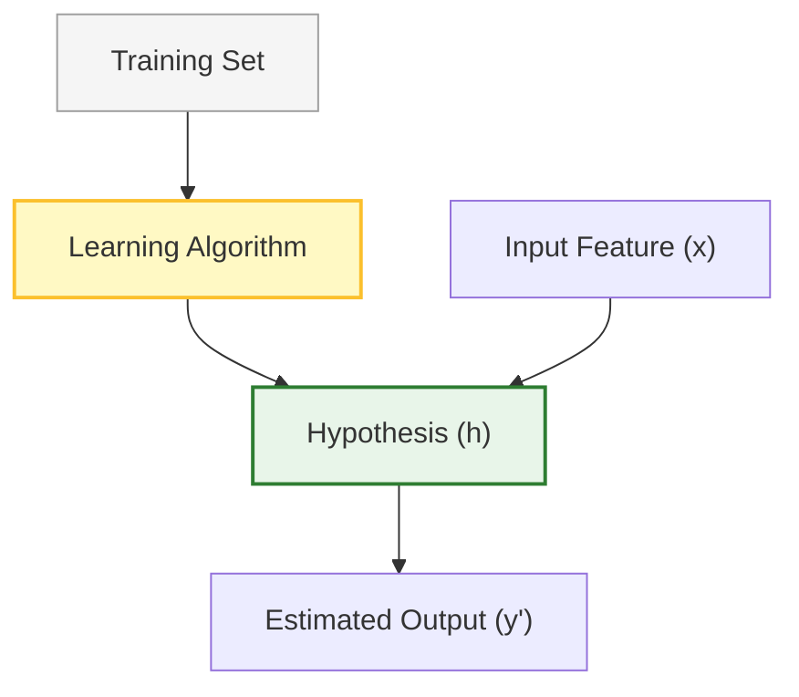
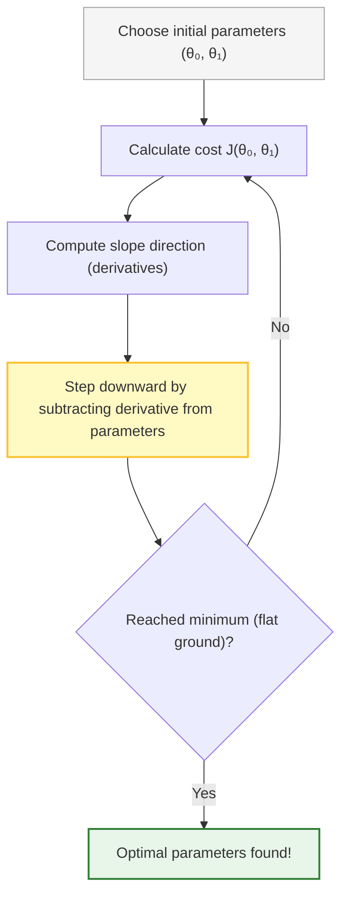

# 📖 Machine Learning Study Guide: Linear Regression with One Variable

This study guide covers model representation, the cost function (least squares error), and the gradient descent algorithm.

---

## 1. Model Representation

In supervised learning with regression, our goal is to predict a continuous valued output based on labeled input data. For **univariate linear regression** (linear regression with one variable), we model the relationship between a single independent variable and a dependent variable as a straight line.

### Key Notation

*   $m$: The total number of training examples (rows in the dataset).
*   $x$: The input variable, also known as the **independent variable** or **feature**.
*   $y$: The output variable, also known as the **dependent variable** or **target variable**.
*   $(x, y)$: Represents a single training example.
*   $(x^{(i)}, y^{(i)})$: Represents the specific $i$-th training example in the dataset.

### The Supervised Learning Pipeline

The training set is fed into the learning algorithm. The learning algorithm outputs a function, traditionally denoted as $h$ (standing for **hypothesis**). The hypothesis function takes an input $x$ and estimates the output value $y$.

### The Hypothesis Function
For linear regression with one variable, we represent the hypothesis function $h_\theta(x)$ as:
$$h_\theta(x) = \theta_0 + \theta_1 x$$

*   $\theta_0$ and $\theta_1$ are the **parameters** (or weights) of the model.
*   $\theta_0$ represents the **y-intercept** (the value of $y$ when $x = 0$).
*   $\theta_1$ represents the **slope** of the line (change in $Y$ divided by the change in $X$).

### Types of Regression Relationships
Before building a model, it is helpful to visualize the data using a **scatter plot** of all $(x^{(i)}, y^{(i)})$ pairs. The shape of the scatter plot suggest which regression relationship best fits the data:

---

## 2. The Cost Function (Least Squares)

To find the line that "best fits" our data, we must choose values for $\theta_0$ and $\theta_1$ such that the difference between the actual values ($y$) and predicted values ($h_\theta(x)$) is minimized. 

### Residual Error
For any training example $i$, the prediction error (or residual error $\varepsilon_i$) is the vertical distance between the data point and the hypothesis line:
$$\varepsilon_i = h_\theta(x^{(i)}) - y^{(i)}$$

### Mean Squared Error (MSE) Cost Function
To prevent positive and negative errors from canceling each other out, we square the errors. The average of these squared errors defines our cost function $J(\theta_0, \theta_1)$, also called the **Mean Squared Error (MSE)** or **Squared Error Cost Function**:

$$J(\theta_0, \theta_1) = \frac{1}{2m} \sum_{i=1}^{m} \left( h_\theta(x^{(i)}) - y^{(i)} \right)^2$$

*   The factor of $\frac{1}{2}$ is added for mathematical convenience (it cancels out the power of $2$ when we calculate derivatives).
*   Our optimization goal is to **minimize** $J(\theta_0, \theta_1)$.

### Cost Function Visualization (with $\theta_0 = 0$)
To understand the cost function, we can simplify the model by setting the intercept parameter $\theta_0 = 0$, giving us:
$$h_\theta(x) = \theta_1 x$$

*   **Hypothesis $h_\theta(x)$:** A function of the input variable $x$. Its slope changes as we vary $\theta_1$.
*   **Cost Function $J(\theta_1)$:** A function of the parameter $\theta_1$.
    *   Plotting $J(\theta_1)$ against different values of $\theta_1$ produces a 2D **parabola** (convex function).
    *   The bottom of this parabola is the global minimum where the prediction error is minimized.
    *   If the data points align perfectly with a slope of $1$, then at $\theta_1 = 1$, the cost $J(1) = 0$.

---

## 3. Gradient Descent

To find the parameters $\theta_0$ and $\theta_1$ that minimize the cost function $J$ without manually plotting it (which is impossible for higher-dimensional data), we use **Gradient Descent**.

### The Metaphor
Imagine standing at a high point in a hilly landscape. Your goal is to reach the lowest point (the valley) as quickly as possible.
1.  You look around and determine the direction of the steepest descent.
2.  You take a step in that direction.
3.  You repeat this process until you reach a flat area (a local minimum).

### The Update Algorithm
Repeat until convergence (where the parameters stop changing significantly):

$$\theta_j := \theta_j - \alpha \frac{\partial}{\partial \theta_j} J(\theta_0, \theta_1) \quad (\text{for } j=0 \text{ and } j=1)$$

*   **$\alpha$ (Learning Rate):** A positive constant that determines the step size.
    *   If $\alpha$ is **too small**, gradient descent will take many steps and be very slow.
    *   If $\alpha$ is **too large**, gradient descent can overshoot the minimum, fail to converge, or even diverge.
*   **$\frac{\partial}{\partial \theta_j} J(\theta_0, \theta_1)$ (Derivative/Slope):**
    *   If the slope is **positive**, the subtraction moves the parameter to the **left** (decreasing $\theta_j$).
    *   If the slope is **negative**, the subtraction moves the parameter to the **right** (increasing $\theta_j$).

> [!IMPORTANT]
> **Simultaneous Update Requirement:**
> When implementing gradient descent, you must update both parameters **simultaneously**. Calculating one parameter and immediately using it to compute the next will lead to incorrect updates.
> $$\text{temp}_0 := \theta_0 - \alpha \frac{\partial}{\partial \theta_0} J(\theta_0, \theta_1)$$
> $$\text{temp}_1 := \theta_1 - \alpha \frac{\partial}{\partial \theta_1} J(\theta_0, \theta_1)$$
> $$\theta_0 := \text{temp}_0$$
> $$\theta_1 := \text{temp}_1$$

---

## 4. Gradient Descent for Linear Regression

By applying the derivatives of the Mean Squared Error cost function to the gradient descent algorithm, we obtain the update equations for univariate linear regression:

### Deriving the Equations
By substituting $h_\theta(x) = \theta_0 + \theta_1 x$ into $J(\theta_0, \theta_1)$ and taking partial derivatives, we get:

*   **For $j = 0$:**
    $$\frac{\partial}{\partial \theta_0} J(\theta_0, \theta_1) = \frac{1}{m} \sum_{i=1}^{m} \left( h_\theta(x^{(i)}) - y^{(i)} \right)$$
*   **For $j = 1$:**
    $$\frac{\partial}{\partial \theta_1} J(\theta_0, \theta_1) = \frac{1}{m} \sum_{i=1}^{m} \left( h_\theta(x^{(i)}) - y^{(i)} \right) \cdot x^{(i)}$$

### The Final Update Rules
Repeat until convergence:

1.  $$\theta_0 := \theta_0 - \alpha \frac{1}{m} \sum_{i=1}^{m} \left( h_\theta(x^{(i)}) - y^{(i)} \right)$$
2.  $$\theta_1 := \theta_1 - \alpha \frac{1}{m} \sum_{i=1}^{m} \left( h_\theta(x^{(i)}) - y^{(i)} \right) \cdot x^{(i)}$$

### Key Properties
*   **Convexity:** The cost function for linear regression is a **convex quadratic function** (often called a bowl shape). Because of this, it has no local minima other than the **single global minimum**. Gradient descent will always converge to the global minimum (assuming the learning rate $\alpha$ is set correctly).
*   **"Batch" Gradient Descent:** This method is called "batch" gradient descent because each step evaluates the entire training set (all $m$ examples) inside the summation.
