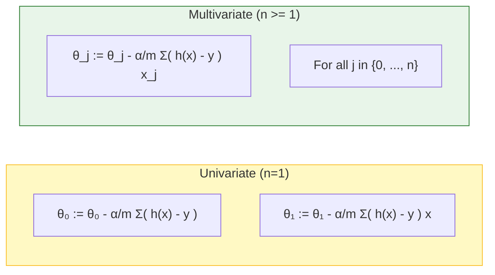
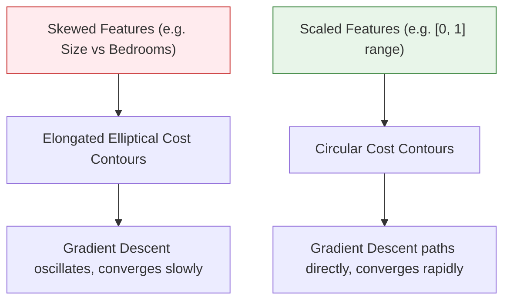

# 📖 Machine Learning Study Guide: Linear Regression with Multiple Variables & Polynomial Regression

This document provides a comprehensive reference covering the mathematical foundations, matrix notation, optimization algorithms, practical tuning techniques (feature scaling, mean normalization, learning rate selection), polynomial regression, and generalization concepts (underfitting vs. overfitting) of Multivariate Linear Regression.

---

## 1. Multi-Variable Model Representation

In the real world, predictions rarely depend on a single feature. For instance, the price of a house is determined not just by its size, but also by the number of bedrooms, the number of floors, and its age. **Multivariate Linear Regression** extends univariate linear regression to accommodate multiple input features.

### Key Notation

*   $n$: The total number of features in the dataset.
*   $m$: The total number of training examples (the size of the dataset).
*   $x^{(i)}$: The input feature vector for the $i$-th training example.
*   $x^{(i)}_j$: The value of feature $j$ in the $i$-th training example.

> [!NOTE]
> *   $x^{(i)}$ is represented as a vector of features.
> *   The index $j$ represents a specific feature column (from $1$ to $n$).

#### Data Matrix Example ($n = 4$, $m = 47$)

| Size in $\text{feet}^2$ ($x_1$) | Number of Bedrooms ($x_2$) | Number of Floors ($x_3$) | Age of Home in Years ($x_4$) | Price ($y$) in $\$1,000\text{s}$ |
| :------------------------------ | :------------------------- | :----------------------- | :--------------------------- | :------------------------------- |
| $2104$                          | $5$                        | $1$                      | $45$                         | $460$                            |
| $1416$                          | $3$                        | $2$                      | $40$                         | $232$                            |
| $1534$                          | $3$                        | $2$                      | $30$                         | $315$                            |
| $852$                           | $2$                        | $1$                      | $36$                         | $178$                            |
| $\vdots$                        | $\vdots$                   | $\vdots$                 | $\vdots$                     | $\vdots$                         |

From the table above:
*   For the 2nd training example ($i = 2$):
    $$x^{(2)} = \begin{bmatrix} 1416 \\ 3 \\ 2 \\ 40 \end{bmatrix}$$
*   For the specific feature values:
    *   $x^{(2)}_1 = 1416$ (size)
    *   $x^{(2)}_2 = 3$ (bedrooms)
    *   $x^{(4)}_1 = 852$ (size of the 4th house)

---

### The Hypothesis Function

The hypothesis function $h_\theta(x)$ for linear regression with multiple variables is:

$$h_\theta(x) = \theta_0 + \theta_1 x_1 + \theta_2 x_2 + \dots + \theta_n x_n$$

Where:
*   $\theta_0$ is the bias/intercept term (base price).
*   $\theta_1, \theta_2, \dots, \theta_n$ are the parameters (weights) corresponding to features $x_1, x_2, \dots, x_n$.

#### Intuitive Example
Assume the following hypothesis for predicting house prices:
$$h_\theta(x) = 80 + 0.1x_1 + 3x_2 + 0.01x_3 - 2x_4$$
*   **Base Price ($\theta_0 = 80$):** A house with 0 square feet, 0 bedrooms, 0 floors, and 0 age starts at a base price of $\$80k$ ($\$80,000$).
*   **Size Weight ($\theta_1 = 0.1$):** Each additional square foot ($x_1$) increases the predicted price by $\$0.1k$ ($\$100$).
*   **Bedroom Weight ($\theta_2 = 3$):** Each additional bedroom ($x_2$) adds $\$3k$ ($\$3,000$) to the price.
*   **Floor Weight ($\theta_3 = 0.01$):** Each additional floor ($x_3$) adds only $\$0.01k$ ($\$10$) to the price (minimal impact).
*   **Age Weight ($\theta_4 = -2$):** Each year of age ($x_4$) decreases the house value by $\$2k$ ($\$2,000$), showing a negative linear relationship.

---

### Vector and Matrix Formulation

To write the hypothesis in a compact vector notation, we define a dummy feature $x_0 = 1$ for every training example. Thus, the feature vector $x$ and parameter vector $\theta$ are represented as $(n+1)$-dimensional column vectors:

$$x = \begin{bmatrix} x_0 \\ x_1 \\ x_2 \\ \vdots \\ x_n \end{bmatrix} \in \mathbb{R}^{n+1} \quad (\text{where } x_0 = 1)$$

$$\theta = \begin{bmatrix} \theta_0 \\ \theta_1 \\ \theta_2 \\ \vdots \\ \theta_n \end{bmatrix} \in \mathbb{R}^{n+1}$$

Using the vector dot product, we can express the hypothesis compactly as:

$$h_\theta(x) = \theta_0 x_0 + \theta_1 x_1 + \dots + \theta_n x_n = \theta^T x$$

Where $\theta^T$ is the transpose of $\theta$ (converting the column vector into a row vector):

$$\theta^T = \begin{bmatrix} \theta_0 & \theta_1 & \dots & \theta_n \end{bmatrix}$$

$$\theta^T x = \begin{bmatrix} \theta_0 & \theta_1 & \dots & \theta_n \end{bmatrix} \begin{bmatrix} x_0 \\ x_1 \\ \vdots \\ x_n \end{bmatrix} = \theta_0 x_0 + \theta_1 x_1 + \dots + \theta_n x_n$$

---

## 2. Gradient Descent for Multiple Variables

Our objective is to find the parameter vector $\theta$ that minimizes the Mean Squared Error (MSE) cost function:

$$J(\theta) = J(\theta_0, \theta_1, \dots, \theta_n) = \frac{1}{2m} \sum_{i=1}^m \left( h_\theta(x^{(i)}) - y^{(i)} \right)^2$$

### Gradient Descent Algorithm
Repeat until convergence (simultaneously updating all parameters $\theta_j$):

$$\theta_j := \theta_j - \alpha \frac{\partial}{\partial \theta_j} J(\theta) \quad (\text{for } j=0, \dots, n)$$

### Univariate vs. Multivariate Comparison

By substituting the derivative of the cost function, we obtain the explicit update equations:

*   **For $j = 0$:**
    $$\theta_0 := \theta_0 - \alpha \frac{1}{m} \sum_{i=1}^m \left( h_\theta(x^{(i)}) - y^{(i)} \right) x^{(i)}_0$$
    *(Since $x^{(i)}_0 = 1$, this simplifies to the univariate bias update rule.)*
*   **For $j = 1$:**
    $$\theta_1 := \theta_1 - \alpha \frac{1}{m} \sum_{i=1}^m \left( h_\theta(x^{(i)}) - y^{(i)} \right) x^{(i)}_1$$
*   **For any parameter $j$:**
    $$\theta_j := \theta_j - \alpha \frac{1}{m} \sum_{i=1}^m \left( h_\theta(x^{(i)}) - y^{(i)} \right) x^{(i)}_j$$

> [!IMPORTANT]
> Just like in univariate regression, all parameters $\theta_0, \theta_1, \dots, \theta_n$ **must be updated simultaneously** in every iteration.

---

## 3. Practical Tips: Feature Scaling & Mean Normalization

When features reside on drastically different scales, gradient descent can be extremely inefficient. 

### Why is Feature Scaling Necessary?
*   **Cost Contours:** If one feature has a very large range (e.g., house size: $0 - 2000 \text{ feet}^2$) and another is small (e.g., bedrooms: $1-5$), the contour plot of the cost function $J(\theta)$ will form highly skewed, narrow, and elongated ellipses.
*   **Inefficient Path:** Gradient descent will overshoot back and forth across the valley, taking a long time (many iterations) to find the global minimum.
*   **Circular Contours:** Scaling features to similar ranges creates symmetric, circular contours, allowing gradient descent to path directly and rapidly to the global minimum.

---

### Feature Scaling Methods

#### 1. Simple Scaling (Dividing by Maximum Value)
Divide each feature by its maximum value in the training set to scale it to the range $[0, 1]$:
$$x_1 = \frac{\text{size}}{2000}$$
$$x_2 = \frac{\text{bedrooms}}{5}$$

This ensures that $0 \le x_1 \le 1$ and $0 \le x_2 \le 1$.

---

#### 2. Mean Normalization
Replace each feature $x_i$ with $x_i - \mu_i$ so that the average value of each feature is approximately zero. We then divide by the range (max - min) or the standard deviation $S_i$:

$$x_i := \frac{x_i - \mu_i}{S_i}$$

Where:
*   $\mu_i$ is the **mean/average** value of feature $i$ in the training set.
*   $S_i$ is the **range** ($x_{i,\text{max}} - x_{i,\text{min}}$) or the standard deviation.

##### Example calculations:
*   **Size feature ($x_1$):** Range: $0 - 2000 \text{ feet}^2$, Mean size: $1000 \text{ feet}^2$.
    $$x_1 = \frac{\text{size} - 1000}{2000} \quad \Rightarrow \quad -0.5 \le x_1 \le 0.5$$
*   **Bedroom feature ($x_2$):** Range: $1 - 5$ bedrooms, Mean bedrooms: $2$.
    $$x_2 = \frac{\text{# bedrooms} - 2}{5} \quad \Rightarrow \quad -0.2 \le x_2 \le 0.6$$

> [!WARNING]
> Do **not** apply feature scaling or mean normalization to the bias/dummy feature $x_0 = 1$.

---

### Target Scaling Range
Features do not need to be scaled to an exact range, but they must be in **approximately** similar scales. The standard target range is:

$$-1 \le x_i \le 1$$

Acceptable vs. Unacceptable ranges:
*   ✔️ $0 \le x_1 \le 3$ (Acceptable)
*   ✔️ $-2 \le x_2 \le 0.5$ (Acceptable)
*   ❌ $-100 \le x_3 \le 100$ (Too large!)
*   ❌ $-0.00001 \le x_4 \le 0.00001$ (Too small!)

---

## 4. Practical Tips: Choosing the Learning Rate ($\alpha$)

### Debugging Gradient Descent (Monitoring Convergence)

To ensure gradient descent is working correctly, plot a **learning curve**:
*   **Y-axis:** Value of the cost function $J(\theta)$ (or $\min_\theta J(\theta)$).
*   **X-axis:** Number of iterations.

#### 1. Correct Behavior (Convergence)
If gradient descent is working properly, the cost $J(\theta)$ should **decrease after every single iteration** and eventually flatten out (converge).
*   If the curve flattens out (e.g. at 300 to 400 iterations), it indicates that the algorithm has converged to a minimum.

---

#### 2. Incorrect Behavior (Divergence & Oscillation)
If $J(\theta)$ increases or oscillates up and down, gradient descent is **not** working properly. This is typically caused by a learning rate $\alpha$ that is **too large**.

*   **Divergence (Cost Increases):** The steps overshoot the minimum repeatedly, climbing up the opposite sides of the quadratic bowl.
*   **Oscillation:** The steps jump back and forth across the valley, failing to converge.
*   **Correction:** Use a smaller learning rate $\alpha$.

---

### Graphical Impact of $\alpha$ on Convergence

The learning rate $\alpha$ governs how quickly or if the model converges:
*   🟡 **Very High Learning Rate:** Diverges immediately (cost increases rapidly; steps overshoot).
*   🟢 **High Learning Rate:** Drops initially but saturates early at a sub-optimal value, oscillating around the minimum.
*   🔴 **Good Learning Rate:** Drops steeply initially and converges smoothly to the global minimum.
*   🔵 **Low Learning Rate:** Converges very slowly, requiring an excessive number of iterations.

---

### Tuning Strategy for $\alpha$

To find the optimal learning rate, run gradient descent with various values of $\alpha$ on a logarithmic-like scale:

$$\dots, 0.001, \, 0.003, \, 0.01, \, 0.03, \, 0.1, \, 0.3, \, 1, \dots$$

1.  Start with a small learning rate (e.g. $0.001$).
2.  If the cost decreases too slowly, try a value that is roughly $3\times$ larger (e.g. $0.003$, then $0.01$).
3.  Repeat until you find a value that converges rapidly.
4.  If the cost increases or oscillates, choose the largest value that works, or step down to a slightly smaller value.

---

## 5. Polynomial Regression

Linear regression can be adapted to fit highly non-linear datasets by formulating **Polynomial Regression**.

### Modeling Curvature

If a straight line does not fit the data, we can use polynomial models:
*   **Quadratic Model:** $h_\theta(x) = \theta_0 + \theta_1 x + \theta_2 x^2$
*   **Cubic Model:** $h_\theta(x) = \theta_0 + \theta_1 x + \theta_2 x^2 + \theta_3 x^3$

#### Curvature Direction and Coefficient Sign
The sign of the coefficient of the highest-order term determines the direction of the curvature:
*   **Linear:**
    *   $Y' = 0 + 1X$ (slopes upward)
    *   $Y' = 0 - 1X$ (slopes downward)
*   **Quadratic:**
    *   $Y' = 0 + 1X + 1X^2$ (opens upward, U-shaped)
    *   $Y' = 0 + 1X - 1X^2$ (opens downward, inverted U-shaped)
*   **Cubic:**
    *   $Y' = 0 + 1X + 1X^2 + 1X^3$ (increases continuously)
    *   $Y' = 0 + 1X + 1X^2 - 1X^3$ (eventually decreases continuously)

---

### Formulating Polynomial as Linear Regression

We can solve polynomial regression using multivariate linear regression by mapping the polynomial terms to new features:

Suppose our hypothesis is a cubic model of house size:
$$h_\theta(x) = \theta_0 + \theta_1(\text{size}) + \theta_2(\text{size})^2 + \theta_3(\text{size})^3$$

We define the features as:
*   $x_1 = \text{size}$
*   $x_2 = (\text{size})^2$
*   $x_3 = (\text{size})^3$

Our hypothesis simplifies to the standard multivariate linear model:
$$h_\theta(x) = \theta_0 + \theta_1 x_1 + \theta_2 x_2 + \theta_3 x_3$$

---

### Critical Importance of Feature Scaling in Polynomial Regression

In polynomial regression, **feature scaling is absolutely essential** because the ranges of the polynomial features expand exponentially:

If $\text{size}$ ranges from $1$ to $1000$:
*   $x_1 = \text{size}$ has range $1 - 1,000$ (order of $10^3$)
*   $x_2 = \text{size}^2$ has range $1 - 1,000,000$ (order of $10^6$)
*   $x_3 = \text{size}^3$ has range $1 - 1,000,000,000$ (order of $10^9$)

Without scaling, the contours of the cost function will be extremely stretched, preventing gradient descent from converging.

---

## 6. Generalization in Machine Learning (Bias vs. Variance)

**Generalization** refers to how well a trained model performs on new, unseen test data. The two main causes of poor model performance are **Underfitting** and **Overfitting**.

| Characteristic | Underfitting (High Bias) | Good Fit / Robust | Overfitting (High Variance) |
| :--- | :--- | :--- | :--- |
| **Description** | Model is too simple; fails to capture the underlying trend. | Model finds the sweet spot; captures the general trend. | Model is too complex; fits the noise and training data too closely. |
| **Training Error** | High | Low | Extremely Low (often 0) |
| **Generalization / Test Error** | High | Low | High |
| **Visual (Regression)** | A straight line fitting curved data. | A smooth quadratic/cubic curve. | A high-degree polynomial that wiggles through every point. |
| **Visual (Classification)** | A straight line divider failing to separate classes. | A smooth boundary curve separating classes. | A highly complex, wiggly boundary separating noise. |

---

### Visual Comparison

#### 1. Regression Example (e.g. Housing Price Prediction)

#### 2. Classification Example (e.g. Microchip Quality Assurance)

---

### Mitigation: Resampling & Cross-Validation

To identify the sweet spot of model complexity (where generalization error is minimized before overfitting begins):
*   **Validation Set:** Split data into training and validation sets.
*   **k-Fold Cross-Validation:** A resampling procedure where the dataset is partitioned into $k$ equal-sized folds. The model is trained on $k-1$ folds and tested on the remaining fold, rotating this process $k$ times to get an accurate estimation of accuracy on unseen data.

