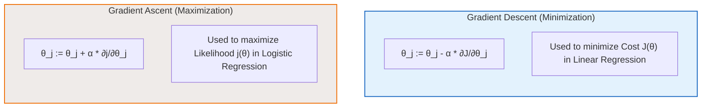

# 📖 Machine Learning Study Guide: Logistic Regression

This document provides a comprehensive academic reference covering the mathematical foundations, formulations, derivations, and optimization algorithms of **Logistic Regression** for binary classification.

---

## 1. The Classification Problem

In supervised learning, when the target variable $y$ takes on discrete, qualitative values rather than continuous ones, we are dealing with a **Classification Problem**. 

### Binary Classification
The simplest form of classification is **Binary Classification**, where the output variable $y$ can belong to one of only two classes:
*   $y \in \{0, 1\}$
    *   **Class 0 (Negative Class):** Represents the absence of a feature or condition (e.g., "Not Spam", "Benign tumor").
    *   **Class 1 (Positive Class):** Represents the presence of the condition we are testing for (e.g., "Spam", "Malignant tumor").

| Application | Input Feature Vector ($x$) | Negative Class ($0$) | Positive Class ($1$) |
| :--- | :--- | :--- | :--- |
| **Email Spam Detection** | Email text features (words, headers) | Not Spam | Spam |
| **Medical Diagnosis** | Tumor size, cell density, patient age | Benign | Malignant |
| **Financial Fraud** | Transaction amount, location, time | Normal Transaction | Fraudulent Transaction |

---

## 2. Thresholding and the Failure of Linear Regression

One intuitive approach to binary classification is to use the linear regression hypothesis $h_\theta(x) = \theta^T x$ and map its continuous output to discrete classes by setting a **Decision Threshold** at $0.5$:

$$h_\theta(x) \ge 0.5 \quad \Rightarrow \quad \text{Predict } y = 1$$
$$h_\theta(x) < 0.5 \quad \Rightarrow \quad \text{Predict } y = 0$$

### Why Linear Regression Fails for Classification
While this thresholding method can sometimes work for simple, balanced datasets, it fails dramatically in the presence of outliers:
1.  **Sensitivity to Outliers:** If a new training example with an extremely large feature value (an outlier) is added, the linear regression model adjusts to minimize the squared error for that distant point. This flattens and shifts the fit line.
2.  **Boundary Shift:** The shift in the linear fit line moves the point where $h_\theta(x) = 0.5$ further to the right. As a result, intermediate data points that were previously classified correctly are now misclassified.
3.  **Unbounded Outputs:** A linear model $\theta^T x$ can output values much larger than $1$ or smaller than $0$, which makes it impossible to interpret the output as a probability.

---

## 3. Binary Logistic Regression & Log-Odds

To resolve the limitations of linear regression, we use **Logistic Regression**. Our goal is to model the conditional probability $p(y=1 | x; \theta)$ such that the model's predictions are bounded between $0$ and $1$:

$$0 \le p(y=1 | x; \theta) \le 1$$

### Range Restrictions and the Linear Predictor
In a linear model, the predictor $\theta^T x$ is unbounded:
$$\theta^T x \in (-\infty, \infty)$$

Because a probability $p$ is strictly bounded, $p \in [0, 1]$, we cannot equate them directly ($p \neq \theta^T x$). We must transform the probability to remove range restrictions.

### The Odds Ratio
First, we define the **Odds** of an event. The odds represent the ratio of the probability of the event occurring ($p$) to the probability of it not occurring ($1-p$):

$$\text{odds} = \frac{p}{1-p}$$

*   If $p = 0.8$, then the odds are $\frac{0.8}{0.2} = 4$ (4 to 1).
*   If $p \in [0, 1]$, then the odds range is bounded on the left but unbounded on the right: $\text{odds} \in [0, \infty)$.

### Log-Odds (Logit Function)
Taking the natural logarithm of the odds (known as the **Log-Odds** or **Logit** function) maps the range from $[0, 1]$ to the entire real number line:

$$\log(\text{odds}) = \log\left(\frac{p}{1-p}\right) \in (-\infty, \infty)$$

Since both the log-odds and the linear predictor $\theta^T x$ span the entire real number line, we can now set them equal to each other:

$$\log\left(\frac{p}{1-p}\right) = \theta^T x$$

---

## 4. Sigmoid Function Derivation & Properties

By setting the log-odds equal to the linear predictor, we can derive the standard logistic model by solving for $p$ step-by-step:

### Mathematical Derivation of the Sigmoid

1.  **Start with the Log-Odds Equation:**
    $$\log\left(\frac{p}{1-p}\right) = \theta^T x$$

2.  **Exponentiate both sides to eliminate the logarithm:**
    $$\frac{p}{1-p} = e^{\theta^T x}$$

3.  **Multiply by $(1-p)$ to isolate $p$:**
    $$p = e^{\theta^T x}(1 - p)$$
    $$p = e^{\theta^T x} - p e^{\theta^T x}$$

4.  **Group all $p$ terms on the left side:**
    $$p + p e^{\theta^T x} = e^{\theta^T x}$$
    $$p(1 + e^{\theta^T x}) = e^{\theta^T x}$$

5.  **Divide by $(1 + e^{\theta^T x})$:**
    $$p = \frac{e^{\theta^T x}}{1 + e^{\theta^T x}}$$

6.  **Divide both the numerator and denominator by $e^{\theta^T x}$ to obtain the standard form:**
    $$p = \frac{\frac{e^{\theta^T x}}{e^{\theta^T x}}}{\frac{1}{e^{\theta^T x}} + \frac{e^{\theta^T x}}{e^{\theta^T x}}} = \frac{1}{1 + e^{-\theta^T x}}$$

---

### The Logistic Sigmoid Function
The resulting mathematical function is the **Standard Logistic Sigmoid Function**, denoted by $g(z)$:

$$g(z) = \frac{1}{1 + e^{-z}} \quad (\text{where } z = \theta^T x)$$

#### Key Mathematical Properties of $g(z)$
*   **Asymptotic Bounds:**
    *   As $z \to \infty$, $e^{-z} \to 0 \quad \Rightarrow \quad g(z) \to \frac{1}{1+0} = 1$
    *   As $z \to -\infty$, $e^{-z} \to \infty \quad \Rightarrow \quad g(z) \to \frac{1}{\infty} = 0$
*   **Symmetry and Intercept:**
    *   At $z = 0$, $g(0) = \frac{1}{1 + e^{0}} = 0.5$
*   **Interpretation:** The output is strictly bounded: $g(z) \in (0, 1)$, allowing it to represent a valid probability.

---

## 5. Hypothesis and Probability Formulation

In Logistic Regression, the hypothesis function $h_\theta(x)$ represents the estimated probability that the output $y = 1$ for a given input feature vector $x$:

$$h_\theta(x) = g(\theta^T x) = \frac{1}{1 + e^{-\theta^T x}} = p(y=1 | x; \theta)$$

Since the target $y$ is binary ($y \in \{0, 1\}$), the probability of the negative class is the complement:

$$p(y=0 | x; \theta) = 1 - h_\theta(x)$$

### Consolidated Probability Expression
For any single observation $(x, y)$, we can consolidate these two separate conditional probability equations into a single expression:

$$p(y | x; \theta) = (h_\theta(x))^y (1 - h_\theta(x))^{1-y}$$

#### Mathematical Verification:
*   **If $y = 1$:**
    $$p(1 | x; \theta) = (h_\theta(x))^1 (1 - h_\theta(x))^{1-1} = h_\theta(x) \quad \text{(Correct)}$$
*   **If $y = 0$:**
    $$p(0 | x; \theta) = (h_\theta(x))^0 (1 - h_\theta(x))^{1-0} = 1 - h_\theta(x) \quad \text{(Correct)}$$

---

## 6. Coefficient Estimation: Maximum Likelihood Estimation (MLE)

Unlike linear regression where parameters are estimated by minimizing Mean Squared Error (MSE), the parameters $\theta$ of logistic regression are estimated using **Maximum Likelihood Estimation (MLE)**.

### Deriving the Likelihood Function $L(\theta)$
Assuming that the training examples in our dataset are independent and identically distributed (i.i.d.), the joint probability (likelihood) of observing the entire target vector $y$ given the feature matrix $X$ and parameters $\theta$ is the product of their individual probabilities:

$$L(\theta) = p(y | X; \theta) = \prod_{i=1}^m p(y^{(i)} | x^{(i)}; \theta)$$

Substituting the consolidated probability expression into the product yields:

$$L(\theta) = \prod_{i=1}^m (h_\theta(x^{(i)}))^{y^{(i)}} (1 - h_\theta(x^{(i)}))^{1-y^{(i)}}$$

---

### Deriving the Log-Likelihood Function $j(\theta)$
Maximizing the product $L(\theta)$ directly is computationally difficult and numerically unstable. To simplify the calculations, we take the natural logarithm of the likelihood function. The logarithm transforms the products into sums:

$$j(\theta) = \log L(\theta) = \log \left( \prod_{i=1}^m (h_\theta(x^{(i)}))^{y^{(i)}} (1 - h_\theta(x^{(i)}))^{1-y^{(i)}} \right)$$

$$j(\theta) = \sum_{i=1}^m \log \left( (h_\theta(x^{(i)}))^{y^{(i)}} (1 - h_\theta(x^{(i)}))^{1-y^{(i)}} \right)$$

Using logarithmic properties ($\log(A \cdot B) = \log A + \log B$ and $\log(A^B) = B \log A$), we obtain the final **Log-Likelihood** function:

$$j(\theta) = \sum_{i=1}^m \left[ y^{(i)} \log\left(h_\theta(x^{(i)})\right) + (1 - y^{(i)}) \log\left(1 - h_\theta(x^{(i)})\right) \right]$$

Our objective is to find the parameter vector $\theta$ that maximizes $j(\theta)$:
$$\max_\theta j(\theta)$$

Unlike linear regression, there is no closed-form analytical solution (like the Normal Equation) to solve for $\theta$ directly. Instead, we must use iterative optimization algorithms.

---

## 7. Optimization: Gradient Ascent vs. Gradient Descent

To maximize the concave log-likelihood function $j(\theta)$, we use **Gradient Ascent**. 

### Calculating the Gradient
To perform gradient updates, we compute the partial derivative of $j(\theta)$ with respect to each parameter $\theta_j$:

$$\frac{\partial}{\partial \theta_j} j(\theta) = \sum_{i=1}^m \left( y^{(i)} - h_\theta(x^{(i)}) \right) x_j^{(i)}$$

---

### Comparison of Optimization Updates

By substituting the partial derivative into the update equation, we obtain the explicit rules:

*   **Gradient Descent (Linear Regression Cost Minimization):**
    $$\theta_j := \theta_j - \alpha \frac{1}{m} \sum_{i=1}^m \left( h_\theta(x^{(i)}) - y^{(i)} \right) x_j^{(i)}$$
    *(Moves parameters opposite to the gradient to reach the minimum cost bowl.)*
*   **Gradient Ascent (Logistic Regression Likelihood Maximization):**
    $$\theta_j := \theta_j + \alpha \sum_{i=1}^m \left( y^{(i)} - h_\theta(x^{(i)}) \right) x_j^{(i)}$$
    *(Moves parameters in the direction of the gradient to climb to the maximum likelihood peak. Note the positive sign ($+$) in the update.)*

> [!IMPORTANT]
> Although the update equations look nearly identical, the hypothesis $h_\theta(x)$ is different:
> *   In linear regression, $h_\theta(x) = \theta^T x$ (unbounded linear activation).
> *   In logistic regression, $h_\theta(x) = \frac{1}{1 + e^{-\theta^T x}}$ (bounded sigmoid activation).
